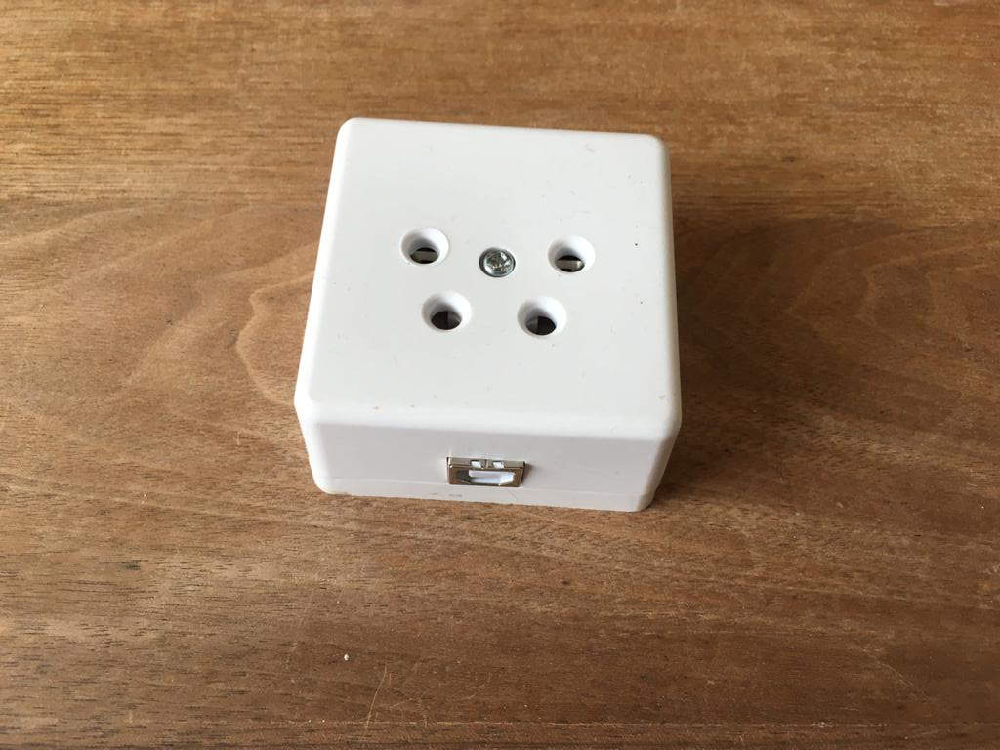
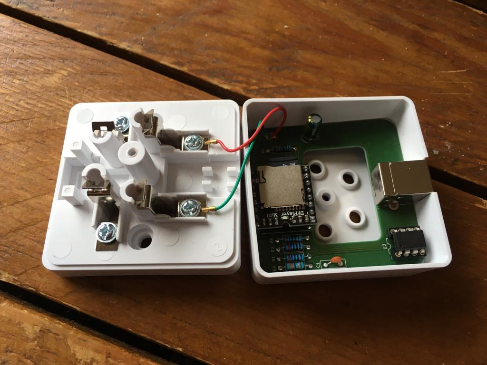
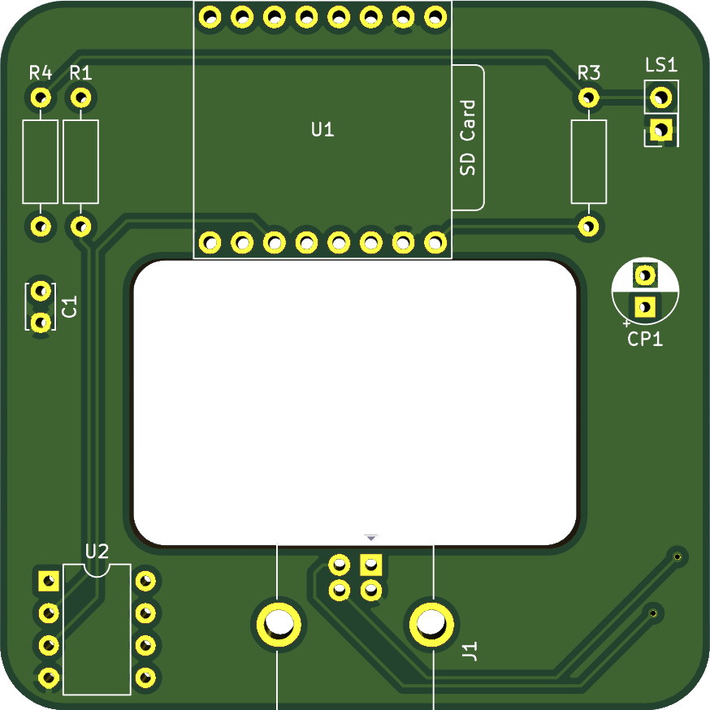

<meta name="google-site-verification" content="D2DzTi8eTN-HyuHSnyPzxfvAiq60_1QDBox8yPDGH7g" />

# V3 is klaar!
Omdat ik zelf ook weer plezier kreeg in het project heb ik v3 gemaakt. Helaas (nog) geen DTMF, maar wel betere stabiliteit (minder vaak/nooit fouten met pulsen tellen) en makkelijker om de firmware te updaten (ISCP port). Ook zit er een LED op het board voor debugging (of om te laten zien dat hij aan staat). Er zijn ook weer printplaten, dus bij interesse, stuur even een mailtje naar: floriaan@tutamail.com.

Ik hoop dat het met deze versie gemakkelijker en leuker wordt voor mensen om te experimenteren met de code en het precies zo te maken als je zelf wil.

Heb je nog een oude versie, dan kun je wel de firmware gebruiken van v3 (alleen in wonderfoon.ino moet je OLD_PIN_CONFIG uncommenten), of anders kun je alles van v2 nog terugvinden in de v2 branch.

Verder valt het mij op dat mensen het lastig vinden om de Attiny te programmeren. Mocht dit je tegenhouden dan kan ik eventueel ook voorgeprogrammeerde chips opsturen, en vaak heb ik ook nog wel andere onderdelen liggen, en als je heel graag een wonderfoon wil, maar je kunt niet solderen, dan wil ik er misschien zelfs wel een voor je in elkaar solderen. Vraag even naar de mogelijkheden op de mail :)

# Wonderfoon mini
De Wonderfoon is een ouderwetse draaischijftelefoon waar je muziek te horen krijgt door de hoorn als je een nummer draait. Het is oorspronkelijk bedacht als "speelgoed" voor (demente) ouderen door Leo Willems. De ouderwetse telefoon uit hun jonge jaren, gecombineerd met muziek uit dezelfde tijd is vaak en leuke ervaring voor ouderen. Het oorspronkelijke idee is gemaakt met een Raspberry Pi (een soort kleine computer). Voor het oorspronkelijke plan moet de telefoon (onherstelbaar) gesloopt worden. Met inspiratie van [een project van Jan Derogee (TeleJukebox)](https://github.com/JanDerogee/TeleJukebox) heb ik een nieuw type Wonderfoon ontworpen. Hierbij hoeft de telefoon niet gesloopt te worden en kun je de stekker van de telefoon gemakkelijk in een doosje stoppen dat zich gedraagt als de telefooncentrale. Ook is de Raspberry Pi vervangen door een kleine mp3 speler (DFPlayer Mini) en een microcontroller (ATTiny85).

Ik krijg vaak soortgelijke vragen door mensen die de wonderfoon aan het bouwen zijn, onderaan deze pagina staat een FAQ sectie, lees die graag eerst voor je een vraag aan mij stuurt. Die beantwoord ik graag, maar ik houd ook erg van mijn weekend :)

# Foto's
De complete wonderfoon is in een klein doosje gestopt wat een standaard doosje is dat gemaakt wordt door Kopp en Q-link. Het printpaatje is zo ontworpen dat het precies past.

Als je het doosje openschroeft zie je het volgende:

Er is een speciaal printplaatje ontworpen die precies in het doosje past.

# Ik wil er een bouwen
In het bestand Bouwhandleiding Wonderfoon staat een handleiding van hoe je er een kunt solderen en programmeren. Met de gerberfiles kun je een printplaat bestellen. Let er goed op bij het bestellen dat je controleert of het midden ook echt een gat wordt voor je de bestelling plaatst. Ik heb ook nog behoorlijk wat printplaatjes liggen, dus je kunt ze ook bij mij bestellen.

# Componentenlijst
Ik kreeg de vraag waar je de componenten kunt kopen. Hieronder een voorbeeld. Dit is zonder enige twijfel niet de goedkoopste optie, maar het kan je in ieder geval helpen met de juiste componenten vinden:

- Attiny85: https://opencircuit.nl/Product/ATtiny85-DIP8
- DFPlayer mini: https://opencircuit.nl/Product/DFPlayer-Een-mini-mp3-speler-voor-Arduino
- Header pins (ICSP): https://opencircuit.nl/Product/Male-header-2x40-2.54mm-zwart
- USB type B connector: https://www.conrad.nl/p/econ-connect-usbbu1bn-usb-connector-bus-inbouw-horizontaal-wit-1-stuks-1883654
- 10 uF elco: https://opencircuit.nl/Product/10uF-35V-Condensator-elektrolytisch
- 1 uF elco: https://opencircuit.nl/Product/1uF-450V-Condensator-elektrolytisch
- LED (optioneel): https://opencircuit.nl/Product/Rood-5mm-diffuse-LED-10-stuks
- 10 kOhm weerstand: https://opencircuit.nl/Product/10K%CE%A9-Metaalfilm-weerstand-1-4W-10-stuks
- 220 Ohm weerstand: https://opencircuit.nl/Product/220%CE%A9-Metaalfilm-weerstand-1-4W-10-stuks
- 2.7 kOhm (dit is 2kOhm, maar dat is ook wel prima): https://opencircuit.nl/Product/2K%CE%A9-Metaalfilm-weerstand-1-4W-10-stuks

# De liedjes nummeren is veel moeite...
Hier heeft Daan een python scriptje voor gemaakt dat je kunt gebruiken:
https://github.com/daanv98/mp3nu

# FAQ
Ik krijg vaak soortgelijke vragen die ik hieronder zal beantwoorden:

#### Hoe moet ik de bestanden op de SD kaart zetten (lees dit sowieso even door, dit zorgt voor het meest problemen)
De DFplayer mini is een handig en goedkoop stukje hardware, maar heeft een paar vreemde eigenschappen, waar je rekening mee moet houden als je bestanden op de SD kaart zet. Met de onderstaande stappen gaat het (bij mij althans) altijd goed:

- Formatteer de SD kaart (FAT)
- Zet eerst de 01/ map erop (https://github.com/floriaanpost/wonderfoon/tree/master/muziek). Dit mapje bevat de kiestoon die je hoort als je de hoorn van de haak neemt en de verbinding verbroken toon en nog wat zaken. Het is van cruciaal belang dat je dit eerst doet voor dat je iets met een MP3 map doet. Dit komt omdat de DFPlayer mini de nummering doet op basis van de volgorde waarop de liedjes op de SD kaart zijn gezet, dus die moeten als aller eerst op de SD kaart worden gezet.
- Maak hierna een mapje genaamd MP3 in de hoofdmap. Zet hierin liedjes op volgorde genummerd, startend met precies 4 cijfers. Alleen de eerste vier cijfers maken uit, daarna kun je alles schrijven wat je wil. Dit nummeren is veel werk, dus daarvoor kun je eventueel het Python scriptje van Daan gebruiken (zie hierboven), of zelf een bash-kunstwerktje maken, of gewoon handmatig te werk gaan. Let op dat er geen gaten zitten in de nummering! Zie als voorbeeld: https://github.com/floriaanpost/wonderfoon/tree/master/muziek/MP3
- Laat hierna de 01 map voor altijd met rust, je kunt wel dingen aanpassen in de MP3 map, maar let op dat er geen verborgen bestanden ontstaan op de SD kaart, die ziet de DFPlayer mini niet als verborgen bestanden, en dat kan zorgen voor vreemde problemen.

Als je een mac hebt (ik ben zelf zo'n persoon) heb je een beetje een probleem. Mac is heel gretig in het produceren van verborgen bestanden en hele trash mappen op sd kaarten. Het is mij maar zelden gelukt om het daar goed te doen. Ik pak nu altijd mijn Linux laptop, wat verreweg het beste gaat op dit gebied. Windows zorgt ook voor weinig problemen.

#### Ik heb de bestanden precies zoals hierboven op mijn SD kaart gezet, en toch werkt het niet.
Ik heb iemand gehad die SD kaartjes had gekocht die ook ik niet aan de praat heb gekregen. We hebben nog steeds geen idee wat het probleem was. Ik heb vaak de allergoedkoopste Kingston SD kaart gebruikt die ik kon vinden en daar nog nooit problemen mee gehad. Geen idee dus wat dit precies kan zijn, maar een andere SD kaart proberen is geen slecht idee.

#### Ik denk dat mijn ATtiny85 niet goed is geprogrammeerd
Als de led op enig moment knippert, betekent dat hoogstwaarschijnlijk dat de ATtiny85 goed is geprogrammeerd, aangezien die de LED aanstuurt, als de LED dus knippert, zoek dan naar een andere oorzaak dan de ATtiny85. Doet de LED helemaal niets, dan is er een goede kans dat de ATtiny85 inderdaad niet goed is geprogrammeerd. 

#### De LED blijft knipperen, en de wonderfoon werkt niet
Zo lang de led knippert is de ATtiny85 bezig met verbinding maken met de kleine MP3 speler, de DFPLayer mini. Dit gaat zelden meteen goed zodra je hem in het stopcontact steekt, de DFPlayer heeft wat meer tijd nodig om op te starten dan de ATtiny85. Als het knipperen echter niet stopt, dan gaat er iets mis. Dit kan betekenen dat er geen SD kaart in de DFPlayer zit (maar ik ga ervan uit dat jullie dat niet vergeten), of dat er iets is waardoor de bestanden op de SD kaart niet goed gelezen kunnen worden, zie het eerste punt over hoe je bestanden op de SD kaart moet zetten, en het tweede punt over sommige SD kaarten die niet werken.

#### Ik hoor bijvoorbeeld de "verkeerd verbonden" toon als ik de hoorn opneem in plaats van de kiestoon, of meteen een liedje
Zet de liedjes juist op de SD kaart, zoals beschreven in het eerste punt. Als je een mac hebt, probeer een windows/linux computer te vinden en probeer het daarmee, of zoek uit hoe het wel lukt op een mac en vertel het mij ;)

#### Ik wil de ATtiny85 programmeren met een Arduino, maar het lukt me niet
Een USBasp is veel makkelijker om te programmeren, en heel goedkoop, maar als je het toch met een arduino wil doen kun je deze handleiding volgen:
https://create.arduino.cc/projecthub/arjun/programming-attiny85-with-arduino-uno-afb829
Er is alleen een ding dat hier niet vermeld staat en dat is dat wanneer je de "ArduinoISP" sketch op de arduino zet je regel 81 moet uncommenten (// #define USE_OLD_STYLE_WIRING). Verder is gebruik ik een kloksnelheid van 1MHz voor de attiny (hoewel hoger ook zou moeten werken).

#### De sketch compileert niet bij het programmeren. 
Je moet de attiny eerst toevoegen aan de arduino IDE.
Volg de instructies van deze repository: https://github.com/damellis/attiny 

